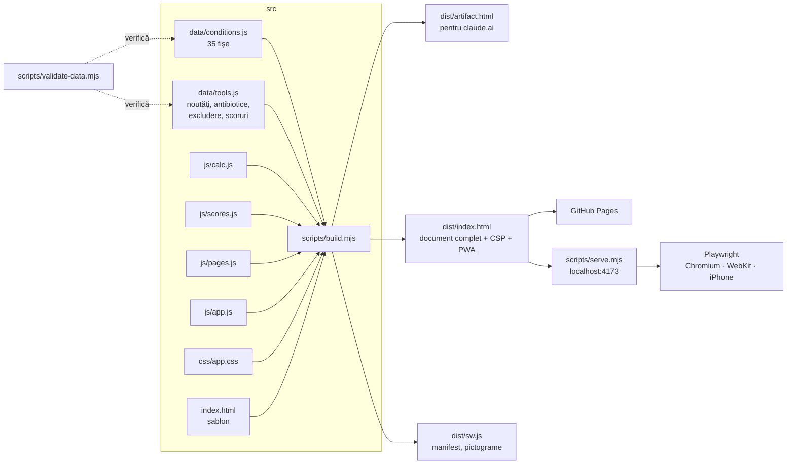
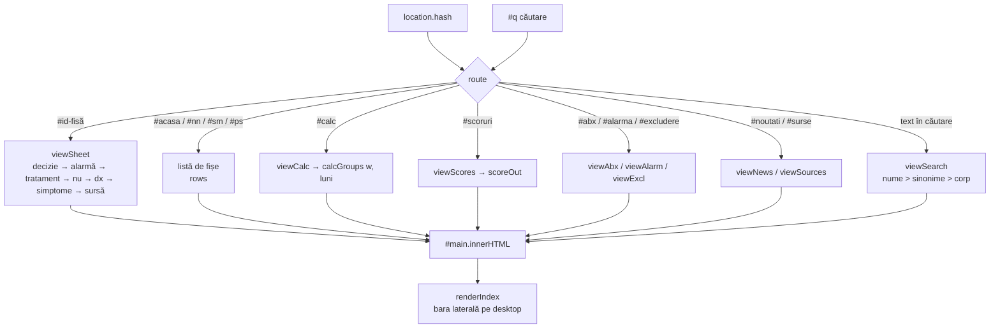

# Arhitectura

Un singur fișier HTML, generat din surse separate, fără cadru de lucru (framework) și fără dependențe la rulare.
Alegerea e deliberată: pagina trebuie să se deschidă instant pe un telefon în timpul consultației, să meargă fără
internet și să poată fi citită și corectată de un medic, nu doar de un programator.

## Fluxul de construire



Ordinea de concatenare (`JS_ORDER` în `build.mjs`) contează: datele intră primele, `app.js` ultimul, pentru că el
pornește rutarea. Toate fișierele din `src/js` și `src/data` sunt scripturi clasice care împart același spațiu de nume;
de aceea ESLint primește lista numelor comune (`eslint.config.mjs`).

## Fluxul la rulare



Nu există stare persistentă pe disc. Căutarea, greutatea din calculator și bifele din scoruri trăiesc în memorie
(`CALC`, `SC`) cât timp pagina e deschisă. Navigarea e pe `#hash`, deci butonul Înapoi al browserului funcționează și
fiecare fișă are adresă proprie (`…/#crup`).

## Modelul unei fișe

```js
{
  id: "crup",                 // ASCII, apare în adresă
  g: "sm",                    // grupa: nn | sm | ps
  n: "Laringotraheită acută (crup)",
  alt: "tuse lătrătoare, stridor, Dexamed",   // sinonime, termeni de părinți, denumiri comerciale → căutare
  key: "Dexametazonă orală doză unică la orice grad de severitate…",   // decizia-cheie, o frază
  sym: [...], dx: [...], alarm: [...], tx: [...], no: [...],           // liste de propoziții
  src: [["NHS Highland, oct. 2024", "https://…"], ["Cochrane 2023", "https://…"]],
  note: "…", uv: "NICE CKS nu a putut fi verificat.", nou: "2026"     // opționale
}
```

Marcaje în text, transformate de `fmt()` din `app.js`: `[[0,15 mg/kg]]` → chip de doză, `**text**` → accent,
`*text*` → italic, `{{text}}` → marcaj „neverificat”. `fmt` scapă HTML-ul înainte de a aplica marcajele, deci datele
nu pot injecta cod.

## Securitate

- Pagina nu primește date de la utilizator în afara câmpului de căutare și a numerelor din calculator; ambele sunt
  scăpate (`esc`) înainte de a ajunge în HTML.
- `dist/index.html` are Content-Security-Policy: scripturi și stiluri doar inline din pagină, fonturi doar de la
  Google Fonts, fără conexiuni externe, fără formulare.
- Service worker-ul cache-uiește doar fișiere din aceeași origine; numele cache-ului conține versiunea de build, deci o
  publicare nouă înlocuiește cache-ul vechi.

## De ce nu un cadru de lucru

Pagina are ~95 KB cu tot cu date și fonturi declarate; un cadru ar adăuga mai mult cod decât toată aplicația, un pas de
compilare cu dependențe de întreținut și un strat în plus de citit pentru un medic care corectează o doză. Structura
„date ca tabele + funcții de randare” face același lucru și rămâne lizibilă în 2030.
